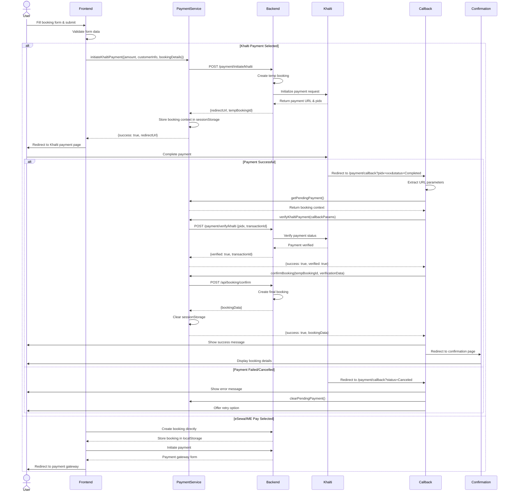

# Payment Integration Sequence Diagram

## Khalti Payment Flow



## Component Interaction Flow

### 1. Booking Initiation (`ticketDetails.jsx` / `HotelBooking.jsx`)
- User fills booking form (name, email, contact, seats/room)
- Frontend validates form data
- User selects payment method (Khalti/eSewa/IME Pay)

### 2. Payment Initiation (Khalti Flow)
```javascript
// Call payment service
const paymentResult = await paymentService.initiateKhaltiPayment({
  amount: totalCost,
  customerInfo: { name, email, phone },
  bookingDetails: { busId, seatIds, ... },
  bookingType: 'BUS' or 'HOTEL'
});

// Redirect to Khalti
window.location.href = paymentResult.redirectUrl;
```

### 3. Payment Callback (`PaymentCallback.jsx`)
```javascript
// Extract parameters from URL
const pidx = searchParams.get('pidx');
const status = searchParams.get('status');

// Verify payment
const verificationResult = await paymentService.verifyKhaltiPayment(callbackParams);

// Confirm booking
const confirmationResult = await paymentService.confirmBooking(
  tempBookingId,
  verificationResult
);

// Redirect to confirmation
navigate('/ticket-confirm' or '/hotel-booking-confirmation');
```

## Data Flow

### SessionStorage Structure
```json
{
  "pendingPayment": {
    "tempBookingId": "TMP-123456",
    "purchaseOrderId": "BUS-1733123456789-5678",
    "bookingDetails": {
      "busId": "bus-123",
      "seatIds": [1, 2, 3],
      "seatNumbers": [5, 6, 7],
      "fullName": "John Doe",
      "email": "john@example.com",
      "contact": "+977 9800000000"
    },
    "customerInfo": {
      "name": "John Doe",
      "email": "john@example.com",
      "phone": "+977 9800000000"
    },
    "amount": 1500,
    "bookingType": "BUS",
    "timestamp": 1733123456789
  }
}
```

### Backend API Contracts

#### POST /payment/initiate/khalti
**Request:**
```json
{
  "amount": 1500,
  "purchaseOrderId": "BUS-1733123456789-5678",
  "purchaseOrderName": "Bus Ticket - Seats 5, 6, 7",
  "customerInfo": {
    "name": "John Doe",
    "email": "john@example.com",
    "phone": "+977 9800000000"
  },
  "bookingDetails": { ... },
  "bookingType": "BUS",
  "returnUrl": "https://example.com/payment/callback",
  "websiteUrl": "https://example.com"
}
```

**Response:**
```json
{
  "code": 200,
  "message": "Payment initiated successfully",
  "data": {
    "redirectUrl": "https://khalti.com/payment/...",
    "tempBookingId": "TMP-123456"
  }
}
```

#### POST /payment/verify/khalti
**Request:**
```json
{
  "pidx": "khalti_pidx_value",
  "transactionId": "khalti_transaction_id",
  "purchaseOrderId": "BUS-1733123456789-5678",
  "tempBookingId": "TMP-123456",
  "amount": 1500,
  "status": "Completed"
}
```

**Response:**
```json
{
  "code": 200,
  "message": "Payment verified successfully",
  "data": {
    "verified": true,
    "status": "COMPLETED",
    "transactionId": "khalti_txn_123"
  }
}
```

#### POST /api/booking/confirm
**Request:**
```json
{
  "tempBookingId": "TMP-123456",
  "transactionId": "khalti_txn_123",
  "bookingDetails": { ... },
  "customerInfo": { ... },
  "bookingType": "BUS",
  "amount": 1500,
  "paymentStatus": "COMPLETED"
}
```

**Response:**
```json
{
  "code": 200,
  "message": "Booking confirmed successfully",
  "data": {
    "bookingId": "BKG-123456",
    "transactionId": "khalti_txn_123",
    "tickets": [...],
    "status": "CONFIRMED"
  }
}
```

## Error Handling

### Payment Initiation Errors
- **Network Error**: Display "Connection failed, please check your internet"
- **Backend Error**: Display backend error message
- **Timeout**: Display "Request timeout, please try again"

### Payment Verification Errors
- **Session Expired**: Clear sessionStorage, redirect to home
- **Payment Cancelled**: Display "Payment cancelled" message
- **Verification Failed**: Display error with support contact
- **Booking Confirmation Failed**: Display error, store payment data for manual processing

## Security Considerations

1. **SessionStorage**: Used instead of localStorage for better security (cleared on tab close)
2. **Expiration**: Payment context expires after 30 minutes
3. **Validation**: All user inputs validated before payment initiation
4. **Sanitization**: Data sanitized before storing or sending to backend
5. **HTTPS**: All payment redirects must use HTTPS
6. **No Sensitive Data**: No payment credentials stored in frontend
